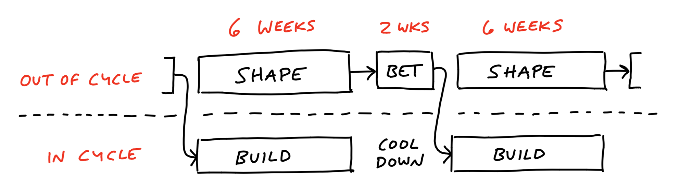
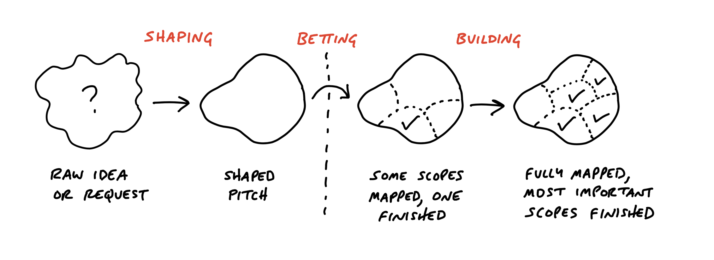

# متناسب با اندازه خودتان تنظیم کنید

> پیوست ۲
> منبع: [Shape Up - Adjust to Your Size](https://basecamp.com/shapeup/4.1-appendix-02)

شیپ‌آپ دقیقاً به همان شکل برای همه تیم‌ها اجرا نمی‌شود. بعضی اصول پایه ثابت‌اند، اما شیوه اجرای آن‌ها باید با اندازه سازمان، بلوغ محصول و ترکیب تیم تنظیم شود.

## حقیقت‌های پایه در برابر روش‌های خاص

حقیقت‌های پایه این‌ها هستند: زمان باید محدود باشد، ایده خام پروژه نیست، کار باید پیش از شرط‌بندی شیپ شود، تیم باید مسئولیت واقعی داشته باشد و اسکوپ باید در طول چرخه قابل معامله باشد.

اما روش‌های خاص، مثل طول دقیق کول‌داون، شکل پیام‌ها یا ابزار پیگیری، می‌توانند تغییر کنند. هدف تقلید ظاهری از بیس‌کمپ نیست؛ هدف حفظ منطق روش در زمینه خودتان است.

## آن‌قدر کوچک که بتوانید بداهه پیش بروید

تیم‌های خیلی کوچک ممکن است به میز شرط‌بندی رسمی نیاز نداشته باشند. همان افراد شاید هم شیپ کنند، هم بسازند، هم تصمیم بگیرند. با این حال، حتی در تیم کوچک هم مفاهیم اشتهای زمانی، مرز پروژه و زمان ثابت ارزش دارند.

## آن‌قدر بزرگ که تخصصی شوید

در تیم‌های بزرگ‌تر، جدا کردن مسیر شیپینگ از مسیر ساختن مهم‌تر می‌شود. افراد باتجربه‌تر می‌توانند روی شیپینگ و کاهش ریسک کار کنند، در حالی که تیم‌های سازنده چرخه‌های متمرکز را اجرا می‌کنند.

