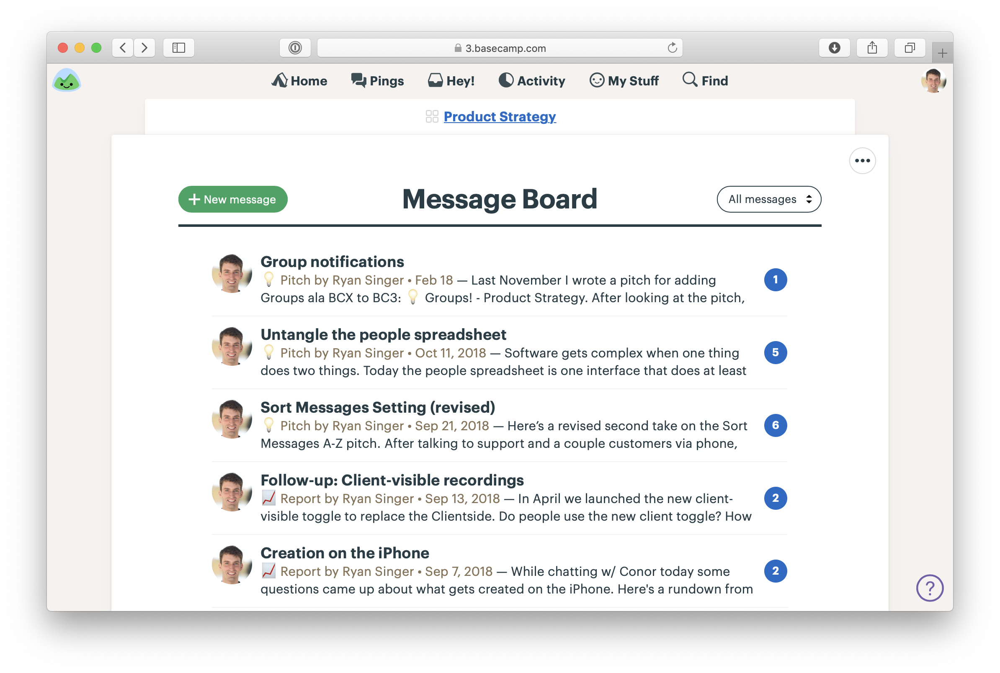
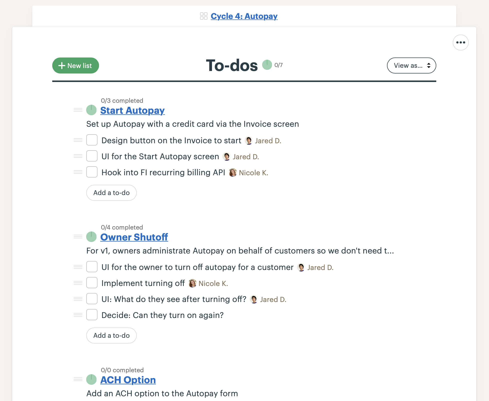
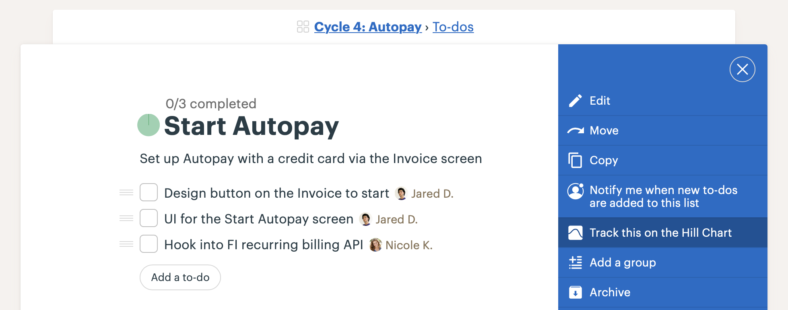
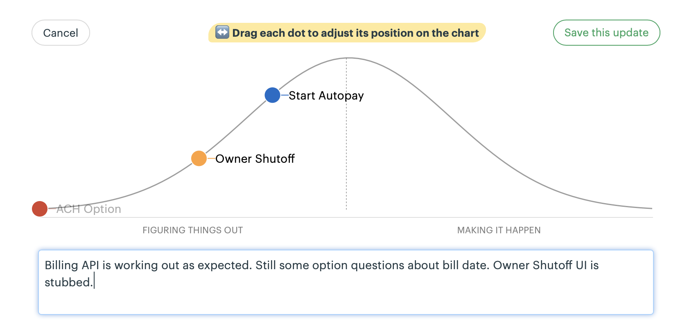

# اجرای شیپ‌آپ در بیس‌کمپ

> پیوست ۱
> منبع: [Shape Up - How to Implement Shape Up in Basecamp](https://basecamp.com/shapeup/4.0-appendix-01)

این پیوست نشان می‌دهد بیس‌کمپ چگونه خود روش شیپ‌آپ را در محصول بیس‌کمپ اجرا می‌کند. ابزار مهم نیست؛ مهم این است که ارتباط، اسکوپ‌ها، تصمیم‌ها و پیشرفت در یک زمینه مشترک دیده شوند.

## یک تیم بیس‌کمپ برای شیپینگ

برای شیپینگ می‌توان یک فضای جداگانه داشت که ایده‌ها، پیچ‌ها و بحث‌های قبل از شرط‌بندی در آن شکل بگیرند. این فضا عمومی برای کل شرکت نیست؛ جای کار نیمه‌پخته و فکر کردن پیش از تصمیم است.

## پروژه‌های بیس‌کمپ برای چرخه‌ها

وقتی روی پروژه‌ای شرط بسته شد، برای آن یک پروژه جداگانه ساخته می‌شود. تیم، پیچ، پیام شروع، بحث‌ها، فایل‌ها و تصمیم‌های چرخه در همان پروژه نگهداری می‌شود تا زمینه از بین نرود.

## فهرست کارها برای اسکوپ‌ها

در بیس‌کمپ، هر اسکوپ می‌تواند یک فهرست کار باشد. تسک‌های داخل فهرست جزئیات همان اسکوپ هستند، نه کل نقشه پروژه. این ساختار کمک می‌کند تیم وضعیت هر بخش را جداگانه ببیند.

## پیگیری اسکوپ‌ها روی نمودار تپه‌ای

نمودار تپه‌ای برای هر اسکوپ نشان می‌دهد کار در سمت کشف است یا اجرا. تیم می‌تواند موقعیت اسکوپ‌ها را در طول چرخه به‌روز کند و همه بدون جلسه اضافه وضعیت را ببینند.

