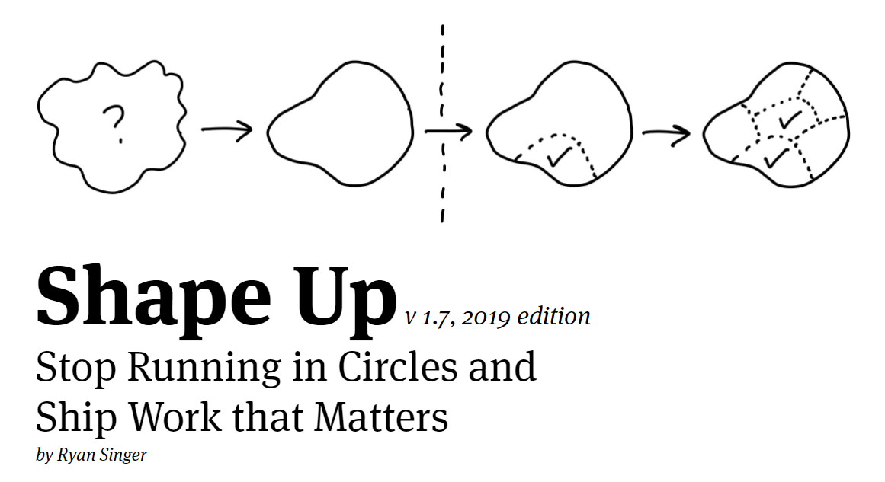

به زودی متن کامل کتاب بر روی سایت بارگزاری خواهد شد.

**عنوان کتاب: shape up - راهکاری برای مدیریت و طراحی محصول نرم افزاری**

**نویسنده : Ryan Singer**

**مترجم : [محمد تکلو](https://profile.ir/takalloo.mohamad/about)**

**[سایت اصلی کتاب](https://basecamp.com/shapeup)**

**حق کپی رایت ناشر: تمامی حق کپی رایت و نشر کتاب با سایت [basecamp](https://basecamp.com) است.**
 
 **کپی رایت ترجمه: استفاده از ترجمه با ذکر نام مترجم و حق کپی رایت ناشر برای عموم آزاد است.**