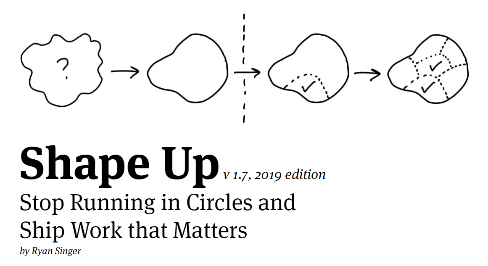

# شیپ‌آپ

**Shape Up** کتابی از رایان سینگر درباره روشی برای طراحی، انتخاب و عرضه کردن پروژه‌های نرم‌افزاری است؛ روشی که در بیس‌کمپ شکل گرفته و به جای بک‌لاگ، اسپرینت‌های خرد و جلسات روزانه، روی شیپینگ، شرط‌بندی و چرخه‌های شش‌هفته‌ای تکیه می‌کند.

**نویسنده:** Ryan Singer
**مترجم:** [محمد تکلو](https://www.linkedin.com/in/mohamad-takalloo-a84764134/)
**متن اصلی:** [Shape Up در سایت Basecamp](https://basecamp.com/shapeup)

حق نشر متن اصلی متعلق به 37signals/Basecamp است. ترجمه فارسی با مجوز صاحب ریپو برای انتشار عمومی تکمیل شده است.

برای شروع مطالعه از [پیش‌گفتار](preface/foreword.md)، [مقدمه نویسنده](abstraction/abstraction.md) یا [اصول شیپینگ](partone/principles_of_shaping.md) آغاز کنید.

واژه‌های کلیدی مانند «شیپینگ»، «پیچ»، «اشتهای زمانی»، «اسکوپ»، «کول‌داون» و «نمودار تپه‌ای» در سراسر ترجمه با یک واژه‌نامه ثابت استفاده شده‌اند.
