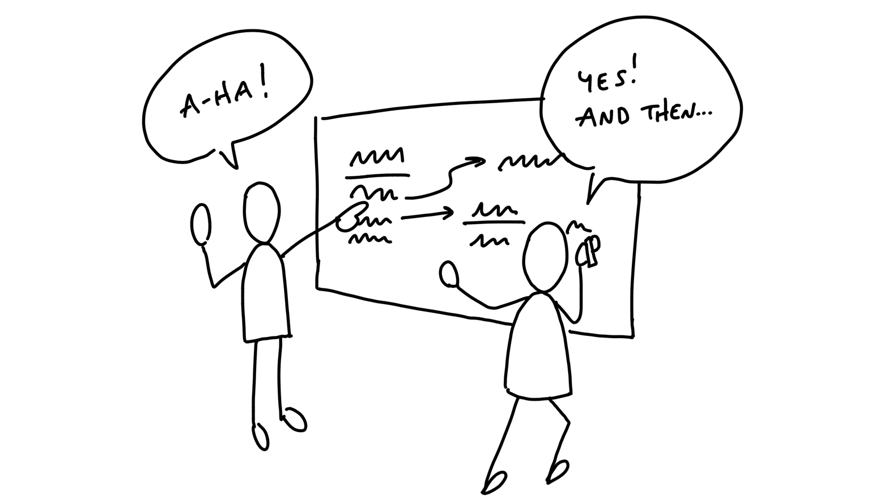
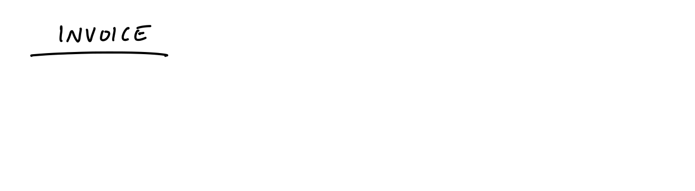
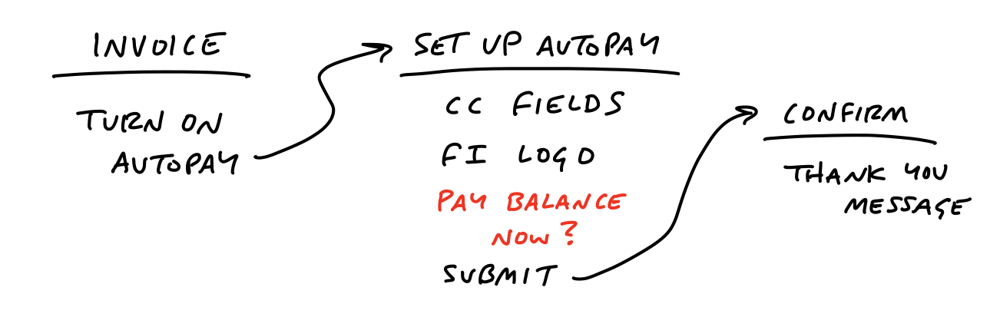
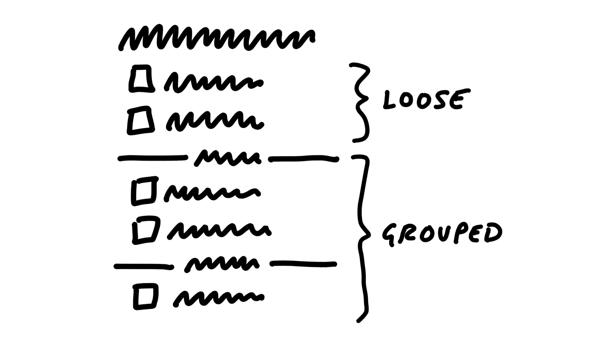

# پیدا کردن عناصر

> فصل ۴ از کتاب شیپ‌آپ
> منبع: [Shape Up - Find the Elements](https://basecamp.com/shapeup/1.3-chapter-04)

بعد از تعیین مرزها، باید شکل کلی راه‌حل را پیدا کنیم. در این مرحله هنوز قرار نیست طراحی نهایی بسازیم. هدف این است که عناصر اصلی، روابط میان آن‌ها و جریان کاربر را در سطحی زمخت اما قابل فهم مشخص کنیم.

## با سرعت درست حرکت کنید

اگر خیلی زود وارد جزئیات بصری شویم، زمان را روی چیزهایی خرج می‌کنیم که شاید اساساً در راه‌حل نهایی نباشند. اگر هم بیش از حد انتزاعی بمانیم، چیزی برای ارزیابی نداریم. سرعت درست یعنی حرکت سریع میان مسئله، عناصر و تعامل‌ها، بدون گرفتار شدن در پیکسل، رنگ و متن نهایی.

## بردبورد

بردبورد روشی برای طراحی رابط کاربری بدون ظاهر بصری است. در بردبورد فقط سه چیز را نشان می‌دهیم: مکان‌ها، امکانات عملیاتی و اتصال‌ها.

- **مکان‌ها** صفحه‌ها یا وضعیت‌هایی هستند که کاربر در آن‌ها قرار می‌گیرد.
- **امکانات عملیاتی** چیزهایی هستند که کاربر می‌تواند با آن‌ها کاری انجام دهد.
- **اتصال‌ها** نشان می‌دهند هر اقدام کاربر را به کجا می‌برد.

بردبورد به ما اجازه می‌دهد جریان اصلی را بدون بحث درباره ظاهر، چیدمان نهایی یا کامپوننت‌ها ببینیم. وقتی می‌خواهیم بفهمیم آیا ایده از نظر تعامل و منطق محصول کار می‌کند یا نه، این ابزار از وایرفریم دقیق مفیدتر است.

### مثال

فرض کنید می‌خواهیم جریان پرداخت فاکتور را ساده کنیم. در بردبورد، لازم نیست فرم نهایی یا طراحی صفحه را رسم کنیم. کافی است نشان دهیم کاربر از کجا شروع می‌کند، چه گزینه‌هایی دارد، بعد از انتخاب هر گزینه چه صفحه‌ای می‌بیند و کجا پرداخت کامل می‌شود.

## اسکچ ماژیک ضخیم

وقتی مسئله بیشتر بصری است، بردبورد کافی نیست. در این حالت از اسکچ ماژیک ضخیم استفاده می‌کنیم: طرحی آن‌قدر زمخت که کسی آن را با طراحی نهایی اشتباه نگیرد، اما آن‌قدر واضح که ایده چیدمان را منتقل کند.

ماژیک ضخیم عمداً اجازه جزئی‌کاری نمی‌دهد. این محدودیت کمک می‌کند روی مفهوم، سلسله‌مراتب و روابط مهم تمرکز کنیم.

## خروجی، عناصر است

خروجی این مرحله طراحی کامل نیست؛ مجموعه‌ای از عناصر حل مسئله است. باید بتوانیم بگوییم راه‌حل چه اجزایی دارد، هر جزء چه نقشی دارد و چطور به اجزای دیگر وصل می‌شود.

## فضا برای طراحان

شیپینگ نباید کار طراحان را از آن‌ها بگیرد. برعکس، باید مسئله و مسیر را روشن کند تا طراح بتواند بهترین شکل بصری و تعاملی را پیدا کند. اگر همه چیز را در مرحله شیپینگ نهایی کنیم، تیم فقط مجری می‌شود و قضاوت حرفه‌ای خود را از دست می‌دهد.

## هنوز قابل تحویل نیست

بردبورد و اسکچ ماژیک ضخیم برای شرط‌بندی کافی‌اند، اما برای ساختن کافی نیستند. آن‌ها به تیم جهت می‌دهند؛ تیم در زمان ساخت باید جزئیات واقعی، حالت‌های مرزی و کیفیت نهایی را کشف کند.

## خط تولید نیست

شیپ‌آپ یک خط تولید نیست که یک گروه طراحی کند و گروه دیگر فقط اجرا کند. شیپینگ و ساختن دو مسیر جدا هستند، اما ساختن همچنان کاری خلاقانه است. تیمی که پروژه را می‌سازد، مالک تصمیم‌های نهایی در محدوده پروژه است.
