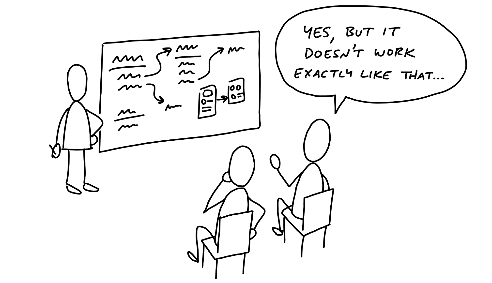
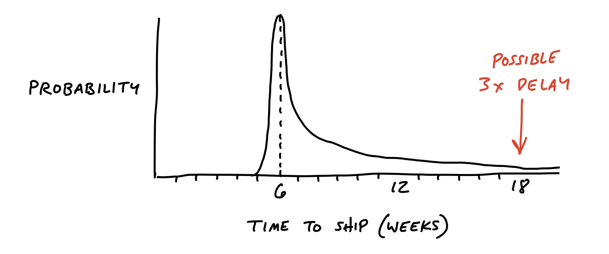

# ریسک‌ها و حفره‌های خرگوش

> فصل ۵ از کتاب شیپ‌آپ
> منبع: [Shape Up - Risks and Rabbit Holes](https://basecamp.com/shapeup/1.4-chapter-05)

بعد از پیدا کردن عناصر راه‌حل، باید آن را از نظر ریسک بررسی کنیم. ایده‌ای که در نگاه اول ساده به نظر می‌رسد ممکن است گوشه‌هایی داشته باشد که تیم را وارد کارهای نامعلوم و پایان‌ناپذیر کند. این گوشه‌ها همان حفره‌های خرگوش هستند.

## دسته‌های مختلف ریسک

ریسک‌ها همیشه فنی نیستند. ممکن است مسئله از جنس تعامل کاربر، وابستگی به سیستم‌های دیگر، ابهام در داده‌ها، حالت‌های خاص، یا انتظارات مشتری باشد. شیپینگ خوب فقط راه‌حل را نشان نمی‌دهد؛ نشان می‌دهد چه چیزهایی می‌توانند پروژه را از مسیر خارج کنند.

## دنبال حفره‌های خرگوش بگردید

حفره خرگوش جایی است که تیم ممکن است وارد آن شود و زمان زیادی را از دست بدهد، بدون اینکه به هسته ارزش پروژه نزدیک‌تر شود. نمونه‌ها شامل وارد شدن به تنظیمات بی‌پایان، پشتیبانی از همه حالت‌های ممکن، یا تلاش برای کامل کردن بخشی است که برای حل مسئله اصلی ضروری نیست.

## مطالعه موردی: پوشاندن یک حفره

گاهی یک راه‌حل تقریباً آماده است، اما یک نقطه مبهم دارد. کار شیپر این است که آن نقطه را پیش از شرط‌بندی روشن کند. ممکن است لازم باشد اسکوپ را کم کنیم، محدودیتی را صریح بنویسیم یا برای حالت خاصی تصمیمی ساده بگیریم تا تیم هنگام ساخت گیر نکند.

## خارج از محدوده را اعلام کنید

یکی از مهم‌ترین کارهای پیچ این است که بگوید چه چیزهایی قرار نیست انجام شوند. اگر قرار نیست نسخه موبایل، وارد کردن داده تاریخی، تنظیمات پیشرفته یا پشتیبانی از یک حالت خاص ساخته شود، باید از ابتدا نوشته شود.

اعلام خارج از محدوده بودن، کیفیت را پایین نمی‌آورد؛ مرز پروژه را روشن می‌کند تا تیم بتواند انرژی خود را روی هسته کار بگذارد.

## کم کنید

وقتی راه‌حل از اشتهای زمانی بزرگ‌تر است، باید آن را کم کنیم. کم کردن اسکوپ یعنی پیدا کردن نسخه‌ای که هنوز مسئله اصلی را حل می‌کند، اما بار غیرضروری را حذف کرده است. گاهی یک راه‌حل ساده‌تر، ارزش بیشتری دارد چون واقعاً عرضه می‌شود.

## با متخصصان فنی مطرح کنید

پیش از نوشتن پیچ نهایی، ایده باید با افراد فنی باتجربه مرور شود. هدف گرفتن تأیید کامل نیست؛ هدف پیدا کردن خطرهایی است که شیپر ندیده است. اگر یک برنامه‌نویس ارشد بگوید بخشی از ایده بسیار پرریسک است، باید آن را دوباره شیپ کنیم.

## ریسک کم شد و آماده نوشتن است

وقتی مسئله، اشتهای زمانی، عناصر راه‌حل، حفره‌های خرگوش و محدودیت‌ها روشن شدند، پروژه آماده تبدیل شدن به پیچ است.
