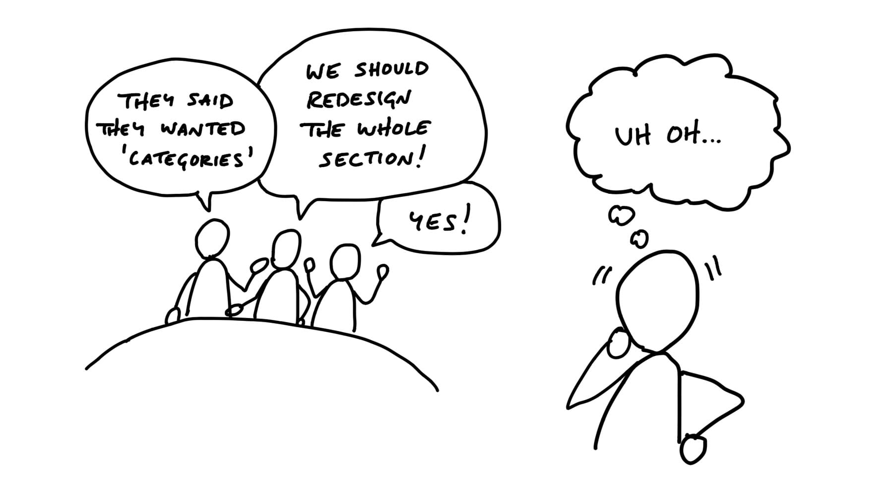

# تعیین مرزها

> فصل ۳ از کتاب شیپ‌آپ
> منبع: [Shape Up - Set Boundaries](https://basecamp.com/shapeup/1.2-chapter-03)

اولین قدم در شیپینگ این است که مرزهای بحث را مشخص کنیم. گفت‌وگو درباره یک بهبود کوچک با گفت‌وگو درباره بازطراحی یک بخش بزرگ فرق دارد. اگر از همان ابتدا اندازه مسئله را روشن نکنیم، تیم خیلی زود وارد راه‌حل‌هایی می‌شود که ممکن است اصلاً ارزش وقت گذاشتن نداشته باشند.

ایده‌های محصول معمولاً به شکل خام وارد می‌شوند: «مشتری‌ها اعلان گروهی می‌خواهند»، «بخش فایل‌ها باید بهتر شود»، یا «کاش تقویم داشتیم». قبل از اینکه وارد جزئیات شویم، باید سه چیز را روشن کنیم: ایده خام چیست، اشتهای زمانی ما چقدر است، و مسئله دقیقاً کجا درد ایجاد می‌کند.

## تعیین اشتهای زمانی

اشتهای زمانی مقدار زمانی است که حاضر هستیم برای یک موضوع خرج کنیم. این با تخمین فرق دارد. تخمین از طراحی شروع می‌شود و به عدد می‌رسد؛ اشتهای زمانی از عدد شروع می‌شود و طراحی را محدود می‌کند.

در بیس‌کمپ معمولاً دو اندازه وجود دارد:

- **بچ کوچک:** کاری که یک طراح و یک یا دو برنامه‌نویس می‌توانند در یک یا دو هفته بسازند.
- **بچ بزرگ:** کاری که همان تیم را برای یک چرخه کامل شش‌هفته‌ای مشغول می‌کند.

اگر ایده‌ای بزرگ‌تر از شش هفته باشد، به جای کش دادن چرخه، مسئله را کوچک‌تر می‌کنیم یا بخشی معنادار از آن را جدا می‌کنیم تا در اشتهای زمانی جا شود.

## زمان ثابت، اسکوپ متغیر

اصل مهم شیپ‌آپ «زمان ثابت، اسکوپ متغیر» است. زمان چرخه تغییر نمی‌کند؛ چیزی که تغییر می‌کند اسکوپ است. این محدودیت باعث می‌شود طراحان و برنامه‌نویسان از همان ابتدا تصمیم‌های واقعی بگیرند: چه چیزی هسته پروژه است؟ چه چیزی می‌تواند حذف شود؟ کدام جزئیات ارزش زمان را ندارند؟

بدون ضرب‌الاجل ثابت، همیشه می‌توان نسخه‌ای کامل‌تر تصور کرد. اما محصول با تصور نسخه کامل عرضه نمی‌شود؛ با انتخاب‌های سخت و حذف هوشمندانه عرضه می‌شود.

## «خوب» نسبی است

راه‌حل خوب در خلأ معنی ندارد. یک راه‌حل فقط نسبت به محدودیت‌ها، اهمیت مسئله و اشتهای زمانی خوب یا بد است. اگر فقط چند روز وقت داریم، شاید یک متن هشدار ساده بهتر از یک سیستم مجوزدهی کامل باشد. اگر یک چرخه کامل داریم، می‌توانیم راه‌حل عمیق‌تری طراحی کنیم.

پس کیفیت را نباید با تعداد قابلیت‌ها یکی دانست. کیفیت یعنی راه‌حلی که در محدودیت موجود، مسئله مهم را به شکل قابل اعتماد حل کند.

## پاسخ به ایده‌های خام

واکنش پیش‌فرض به ایده‌های تازه باید یک «نه» نرم باشد: جالب است، شاید روزی. این پاسخ ایده را نمی‌کشد، اما تعهد هم ایجاد نمی‌کند. ایده باید فرصت پیدا کند تا با شواهد، نمونه‌های واقعی و فشار تکرارشونده اهمیت خود را نشان دهد.

اگر هر ایده‌ای را به بک‌لاگ اضافه کنیم، به مرور انباری از وعده‌های نیمه‌زنده می‌سازیم. در شیپ‌آپ، ایده‌ها تا زمانی که شیپ نشده‌اند، پروژه نیستند.

## محدود کردن مسئله

مرزبندی فقط تعیین زمان نیست؛ باید مسئله را هم دقیق کنیم. درخواست مشتری معمولاً راه‌حل پیشنهادی را در خود دارد، اما کار ما فهمیدن درد واقعی پشت آن است.

مثلاً ممکن است مشتری درخواست قوانین پیچیده‌تر دسترسی بدهد، اما بررسی دقیق نشان دهد مشکل اصلی این است که کاربران نمی‌دانند آرشیو کردن یک فایل چه اثری روی دیگران دارد. در این حالت یک هشدار ساده می‌تواند جای یک پروژه شش‌هفته‌ای را بگیرد.

## مطالعه موردی: تعریف «تقویم»

در درخواست تقویم، سؤال مهم این نبود که «تقویم کامل چه امکاناتی دارد؟» بلکه این بود که «کاربر دقیقاً چه زمانی نبود تقویم را حس می‌کند؟» پاسخ یکی از مشتریان نشان داد نیاز اصلی دیدن زمان‌های خالی برای زمان‌بندی جلسه است، نه ساختن همه چیزهایی که یک تقویم سنتی دارد.

این شناخت مسئله را از «ساختن یک تقویم» به «کمک به دیدن فضاهای خالی» تبدیل کرد. همین محدودسازی راه را برای راه‌حل ساده‌تر جدول نقطه‌ای باز کرد.

## مراقب کیسه‌های درهم باشید

پروژه‌هایی مثل «بازطراحی فایل‌ها» یا «رفکتور سیستم» اگر با مسئله مشخص همراه نباشند، کیسه‌ای از خواسته‌های پراکنده‌اند. چنین پروژه‌هایی پایان روشن ندارند و هرکس برداشت متفاوتی از موفقیت خواهد داشت.

شروع بهتر این است: «اشتراک چند فایل بیش از حد مرحله دارد، باید جریان آن را ساده کنیم.» حالا می‌توان پرسید کدام بخش کار نمی‌کند، در چه زمینه‌ای مشکل ایجاد می‌شود و چه چیزهایی لازم نیست تغییر کند.

## مرزها برقرار شد

وقتی ایده خام، اشتهای زمانی و تعریف محدود مسئله روشن شد، آماده‌ایم به مرحله بعد برویم: پیدا کردن عناصر راه‌حل.
