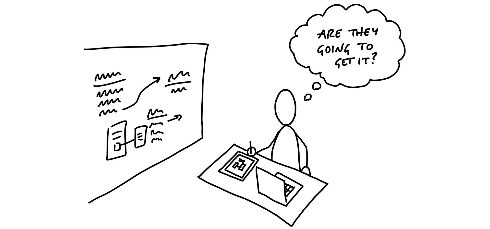
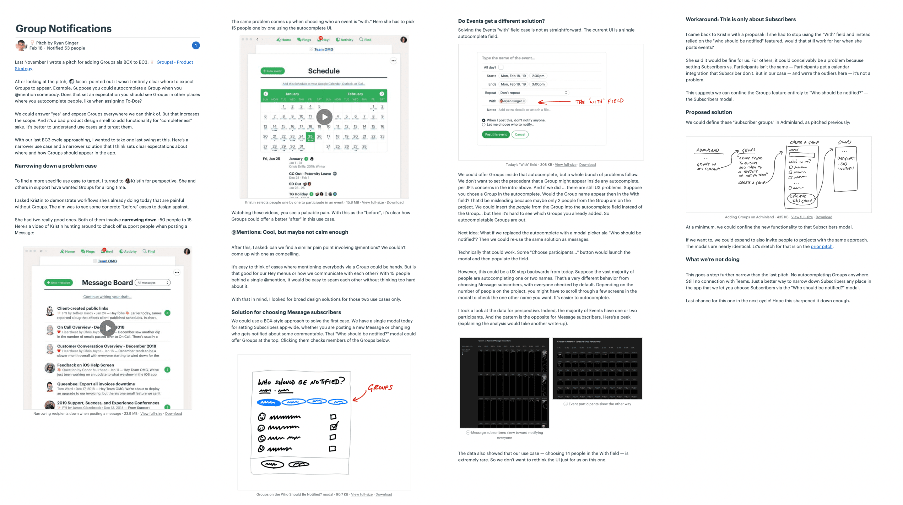
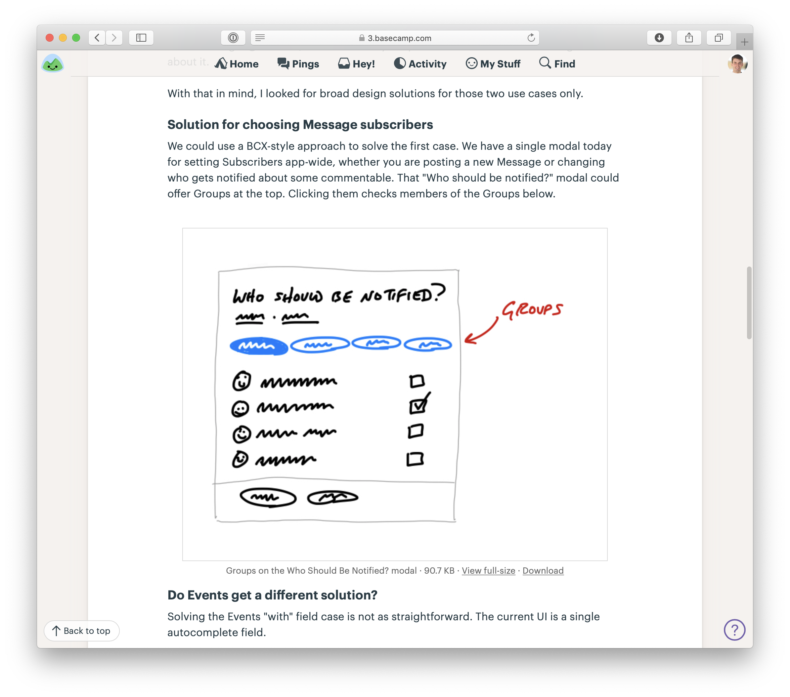
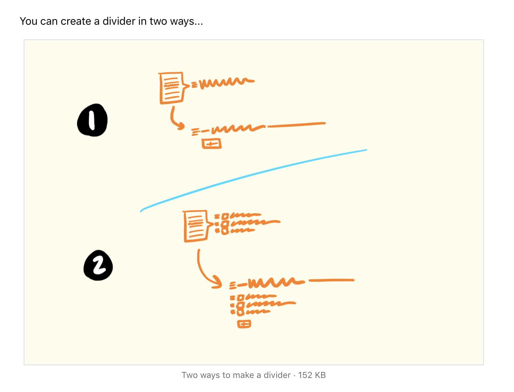
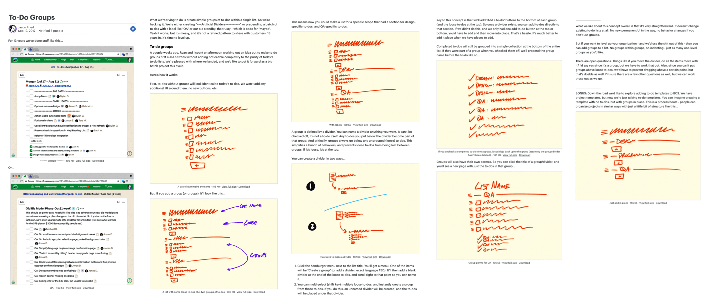

# نوشتن پیچ

> فصل ۶ از کتاب شیپ‌آپ  
> منبع: [Shape Up - Write the Pitch](https://basecamp.com/shapeup/1.5-chapter-06)

پیچ سندی است که کار شیپ‌شده را برای شرط‌بندی آماده می‌کند. پیچ قرار نیست یک مشخصات فنی کامل باشد؛ باید مسئله، اهمیت آن، اشتهای زمانی، راه‌حل، ریسک‌ها و چیزهای خارج از محدوده را به اندازه‌ای توضیح دهد که تصمیم‌گیرندگان بتوانند روی آن شرط ببندند.

## ماده اول: مسئله

پیچ با مسئله شروع می‌شود. باید روشن کند چه چیزی در وضعیت فعلی کار نمی‌کند، چه کسی تحت تأثیر قرار می‌گیرد و چرا اکنون ارزش توجه دارد. مسئله نباید به شکل راه‌حل بیان شود؛ «ساختن تقویم» مسئله نیست، اما «نمی‌توانیم فضاهای خالی را برای زمان‌بندی ببینیم» مسئله است.

## ماده دوم: اشتهای زمانی

بعد از مسئله، باید بگوییم حاضر هستیم چقدر زمان خرج کنیم. اشتهای زمانی تصمیم‌های بعدی را محدود می‌کند و به خواننده نشان می‌دهد باید راه‌حل را در چه اندازه‌ای ببیند: بچ کوچک یا یک چرخه کامل.

## ماده سوم: راه‌حل

راه‌حل باید به اندازه کافی مشخص باشد تا بتوان درباره آن تصمیم گرفت، اما نه آن‌قدر دقیق که کار تیم را قفل کند. بردبورد، اسکچ ماژیک ضخیم یا چند تصویر توضیحی می‌تواند مفهوم را روشن کند.

## کمک کنید ببینند

پیچ خوب فقط توضیح نمی‌دهد؛ دیدن را آسان می‌کند. گاهی یک اسکچ ساده، چند پیکان یا یک تصویر حاشیه‌نویسی‌شده بهتر از چند پاراگراف متن، شکل راه‌حل را منتقل می‌کند.

### اسکچ‌های داخل متن

وقتی اسکچ کوچک است، می‌توان آن را داخل پیام یا سند پیچ گذاشت تا خواننده هم‌زمان متن و تصویر را ببیند.

### اسکچ ماژیک ضخیم حاشیه‌نویسی‌شده

اگر طرح کمی پیچیده‌تر است، حاشیه‌نویسی کمک می‌کند خواننده بداند هر قسمت چه نقشی دارد و کدام جزئیات صرفاً نمایشی هستند.

## ماده چهارم: حفره‌های خرگوش

پیچ باید خطرهایی را که ممکن است تیم را درگیر کنند نام ببرد. نوشتن این خطرها نشانه ضعف پیچ نیست؛ نشانه آن است که شیپر مسئله را جدی دیده و نقاط لغزش را مشخص کرده است.

## ماده پنجم: انجام‌ندادنی‌ها

بخش «No-gos» یا انجام‌ندادنی‌ها مرز پروژه را صریح می‌کند. اگر چیزی در نگاه اول طبیعی به نظر می‌رسد اما قرار نیست در این چرخه ساخته شود، باید همین‌جا نوشته شود.

## مثال‌ها

پیچ‌های خوب می‌توانند درباره اعلان گروهی، مرتب‌سازی پیام‌ها، گروه‌بندی کارها یا یک فرم پرداخت باشند. در همه آن‌ها الگو یکی است: مسئله مشخص، اشتهای زمانی روشن، راه‌حل زمخت اما قابل فهم، ریسک‌های شناخته‌شده و مرزهای واضح.

## آماده ارائه

وقتی پیچ نوشته شد، هنوز پروژه شروع نشده است. پیچ فقط نامزد شرط‌بندی است. در میز شرط‌بندی، تصمیم گرفته می‌شود آیا این پروژه نسبت به گزینه‌های دیگر ارزش گرفتن چرخه بعدی را دارد یا نه.

## اجرای این کار در بیس‌کمپ

در بیس‌کمپ، پیچ‌ها معمولاً به شکل پیام نوشته می‌شوند. تصویرها، اسکچ‌ها و توضیح‌ها در همان پیام قرار می‌گیرند تا همه بتوانند در یک زمینه مشترک درباره پروژه تصمیم بگیرند.
