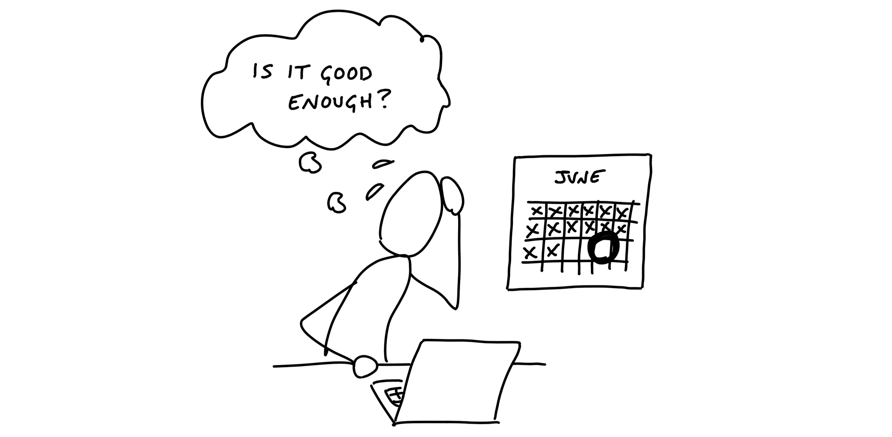
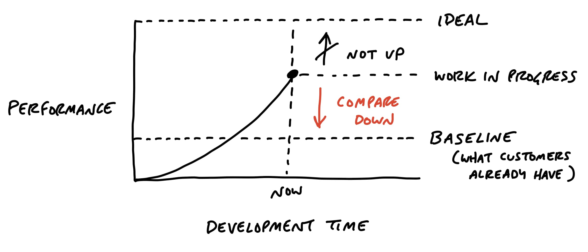

# تصمیم گرفتن درباره زمان توقف

> فصل ۱۴ از کتاب شیپ‌آپ  
> منبع: [Shape Up - Decide When to Stop](https://basecamp.com/shapeup/3.5-chapter-14)

در چرخه ثابت، هنر مهم این است که بدانیم چه زمانی کافی است. هدف ساختن کامل‌ترین نسخه قابل تصور نیست؛ هدف عرضه نسخه‌ای باکیفیت است که مسئله اصلی را حل می‌کند.

## با خط مبنا مقایسه کنید

پرسش درست این نیست که «آیا می‌توانیم بهترش کنیم؟» همیشه می‌توان بهتر کرد. پرسش این است که «آیا این نسبت به وضعیت قبلی مسئله را حل می‌کند؟» خط مبنا همان کاری است که کاربر بدون این قابلیت انجام می‌داد.

## محدودیت‌ها معامله را فعال می‌کنند

وقتی زمان محدود است، تیم مجبور می‌شود معامله کند. معامله یعنی حفظ کیفیت هسته و حذف چیزهایی که برای عرضه لازم نیستند. بدون محدودیت، همه چیز مهم به نظر می‌رسد.

## اسکوپ مثل علف رشد می‌کند

در طول کار، ایده‌های جدید، حالت‌های خاص و جزئیات بهتر ظاهر می‌شوند. اگر مراقب نباشیم، اسکوپ بی‌صدا رشد می‌کند و چرخه را می‌بلعد.

## کم کردن اسکوپ یعنی پایین آوردن کیفیت نیست

کیفیت یعنی چیزی که عرضه می‌شود قابل اعتماد، کامل در هسته خود و مناسب مسئله باشد. حذف موارد غیرضروری کیفیت را پایین نمی‌آورد؛ اغلب کیفیت را بالا می‌برد چون تمرکز تیم را حفظ می‌کند.

## کوبیدن اسکوپ

کوبیدن اسکوپ یعنی با جدیت بپرسیم کدام بخش واقعاً لازم است، کدام حالت را می‌توان حذف کرد و کدام طراحی ساده‌تر همان مسئله را حل می‌کند. این کار باید در طول چرخه انجام شود، نه فقط روزهای آخر.

## QA برای لبه‌هاست

QA نباید جایگزین ساختن درست شود. در پایان چرخه، QA باید لبه‌ها، حالت‌های مرزی و اشکال‌های باقی‌مانده را پیدا کند، نه اینکه تازه هسته پروژه را قابل استفاده کند.

## چه زمانی پروژه را تمدید کنیم؟

تمدید پیش‌فرض نیست. اگر پروژه تقریباً تمام شده و ارزش واضحی دارد، شاید تمدید محدود منطقی باشد. اما اگر هنوز در ابهام است، ادامه دادن خودکار فقط ریسک را پنهان می‌کند. قطع‌کننده مدار باید جدی گرفته شود.
