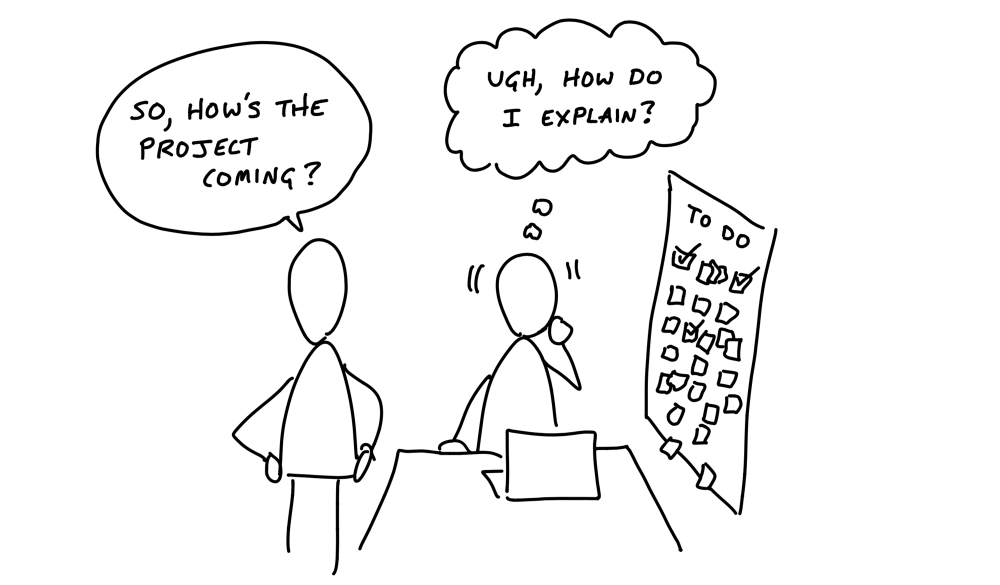
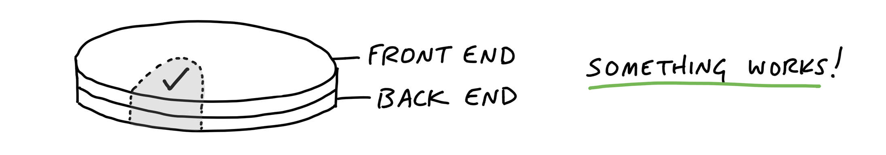
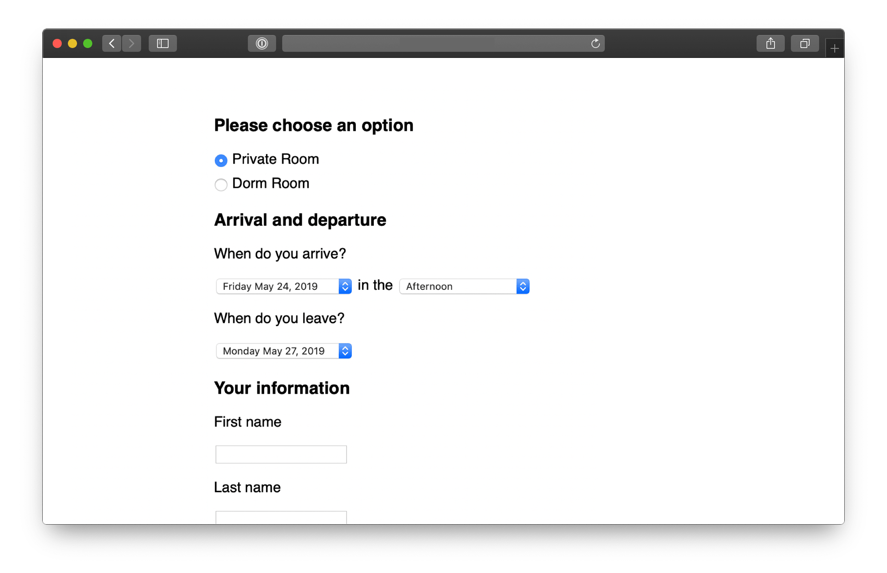

# یک بخش را کامل کنید

> فصل ۱۱ از کتاب شیپ‌آپ
> منبع: [Shape Up - Get One Piece Done](https://basecamp.com/shapeup/3.2-chapter-11)

شروع خوب در چرخه یعنی هرچه زودتر یک برش واقعی از پروژه را کامل و یکپارچه کنیم. این کار ابهام را کاهش می‌دهد و به تیم نشان می‌دهد مسیر ساختن واقعاً چگونه است.

## یک برش را یکپارچه کنید

به جای اینکه ابتدا همه بک‌اند یا همه فرانت‌اند را جداگانه بسازیم، بهتر است یک مسیر کوچک اما واقعی را از ابتدا تا انتها کامل کنیم. این برش باید طراحی، برنامه‌نویسی و اتصال‌ها را کنار هم بیاورد.

## مطالعه موردی: مشتری‌ها در پروژه‌ها

در پروژه‌ای مثل اضافه کردن مشتری‌ها به پروژه‌ها، تیم می‌تواند با یک سناریوی ساده شروع کند: دعوت یک مشتری، نمایش او در پروژه و کنترل سطح دسترسی پایه. با کامل شدن این مسیر، ریسک‌های اصلی آشکار می‌شوند و ادامه کار روشن‌تر می‌شود.

## برنامه‌نویسان لازم نیست منتظر بمانند

اگر طراحی نهایی همه صفحه‌ها آماده نیست، برنامه‌نویسان نباید بیکار بمانند. آن‌ها می‌توانند روی مسیرهای اصلی، مدل داده، اتصال‌ها و رفتارهای پایه کار کنند. طراحی و برنامه‌نویسی باید هم‌زمان و نزدیک به هم جلو بروند.

## امکانات عملیاتی قبل از صفحه‌های پیکسلی

قبل از اینکه صفحه‌ها پیکسل‌به‌پیکسل کامل شوند، باید بدانیم کاربر چه کارهایی می‌تواند انجام دهد و سیستم چگونه پاسخ می‌دهد. امکانات عملیاتی، ستون فقرات تجربه هستند؛ ظاهر نهایی روی آن‌ها سوار می‌شود.

## فقط به اندازه قدم بعدی برنامه‌نویسی کنید

لازم نیست از ابتدا همه زیرساخت احتمالی را بسازیم. هر بار به اندازه‌ای برنامه‌نویسی کنید که قدم بعدی ممکن شود. این کار از ساختن لایه‌های غیرضروری جلوگیری می‌کند و یادگیری را سریع‌تر می‌کند.

## از وسط شروع کنید

شروع از صفحه اول یا جریان کامل همیشه بهترین انتخاب نیست. گاهی بخش میانی پروژه بیشترین ابهام را دارد. اگر آن را اول حل کنیم، بقیه مسیر ساده‌تر می‌شود.
