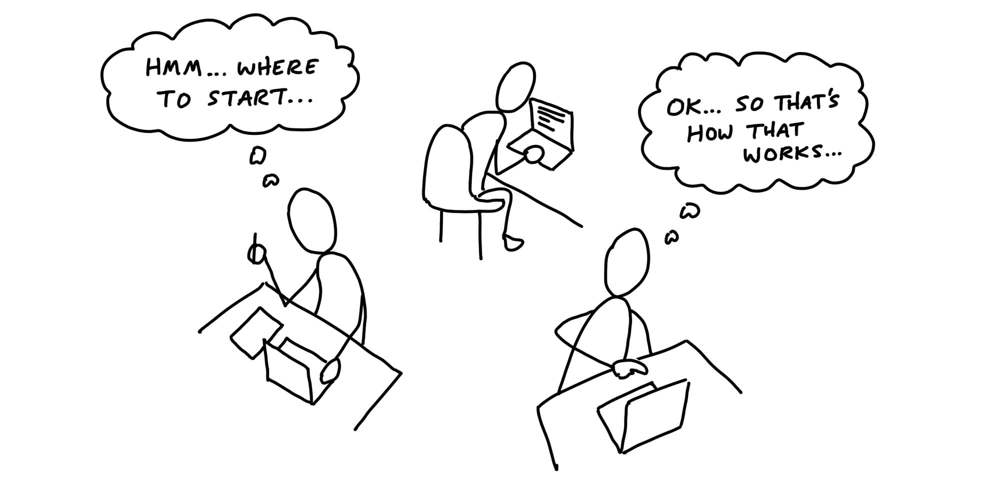
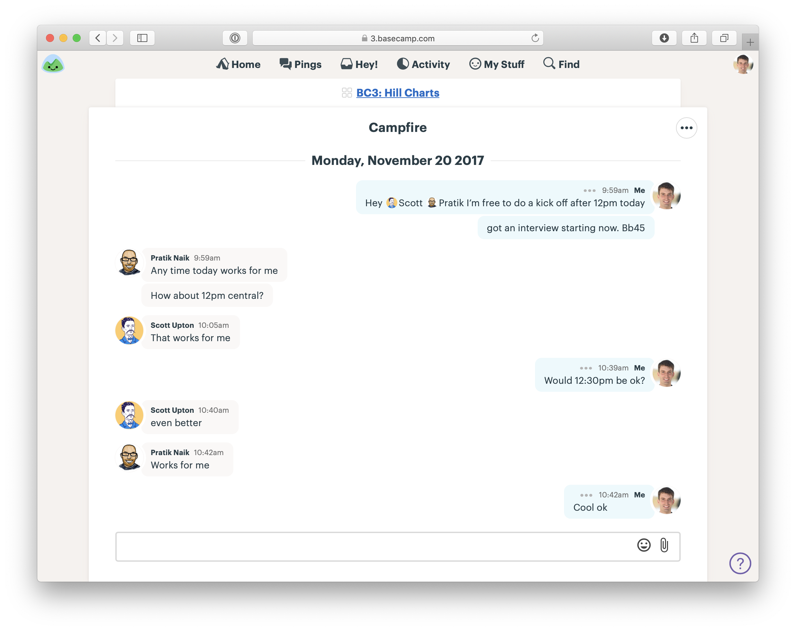

# واگذاری مسئولیت

> فصل ۱۰ از کتاب شیپ‌آپ  
> منبع: [Shape Up - Hand Over Responsibility](https://basecamp.com/shapeup/3.1-chapter-10)

وقتی روی پروژه‌ای شرط بسته شد، مسئولیت از کسانی که آن را شیپ کرده‌اند به تیم سازنده منتقل می‌شود. از اینجا به بعد، تیم باید با تکیه بر پیچ، قضاوت خود و همکاری نزدیک، پروژه را به محصول قابل عرضه تبدیل کند.

## پروژه‌ها را واگذار کنید، نه تسک‌ها

مدیریت نباید پروژه را به فهرستی از وظایف ریز تبدیل کند و بعد آن را به تیم بدهد. چنین کاری مسئولیت واقعی را از تیم می‌گیرد و باعث می‌شود اعضا فقط مجری تصمیم‌های دیگران باشند. خروجی شیپینگ باید جهت و مرز بدهد، نه دستورالعمل خط‌به‌خط.

## انجام‌شده یعنی عرضه‌شده

در شیپ‌آپ، «انجام‌شده» به معنی کد نوشته‌شده یا طراحی تاییدشده نیست. انجام‌شده یعنی چیزی که کاربران می‌توانند از آن استفاده کنند. اگر پروژه در محیط واقعی عرضه نشده باشد، هنوز کامل نیست.

## شروع چرخه

چرخه با یک پیام شروع می‌شود که پیچ، تیم، اشتهای زمانی و انتظار عرضه را توضیح می‌دهد. این پیام زمینه مشترک می‌سازد و به تیم کمک می‌کند بداند از کجا شروع کند.

## جهت‌یابی

در روزهای اول، تیم باید پروژه را بفهمد، مسیرهای اصلی را پیدا کند و درباره نقطه شروع تصمیم بگیرد. این مرحله برای ساختن نقشه ذهنی مشترک مهم است. عجله برای ساختن تسک‌های زیاد می‌تواند تصویر کلی را پنهان کند.

## تسک‌های تصورشده در برابر تسک‌های کشف‌شده

بسیاری از تسک‌هایی که قبل از شروع تصور می‌کنیم، با ورود به کار واقعی تغییر می‌کنند. تیم هنگام ساخت، تسک‌های واقعی را کشف می‌کند. به همین دلیل بهتر است پروژه را به جای فهرست وظایف، به اسکوپ‌های معنادار و قابل تکمیل بشکنیم.
