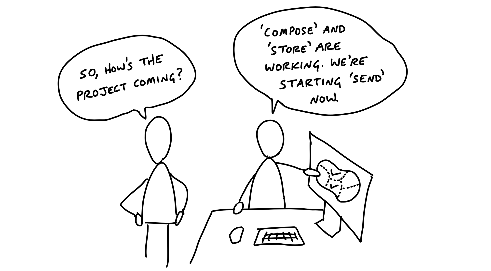
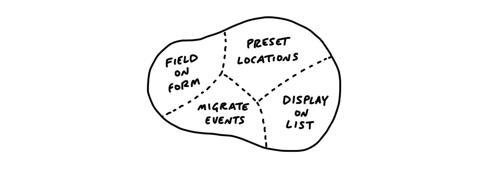
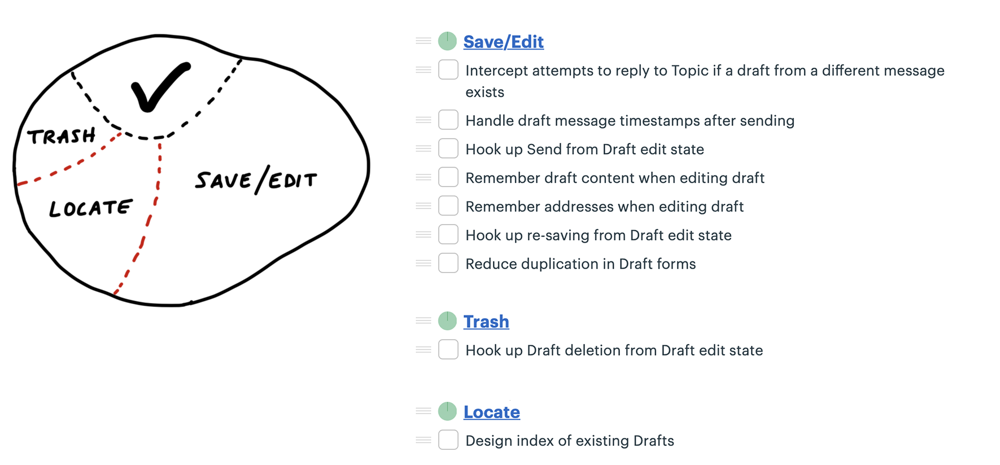
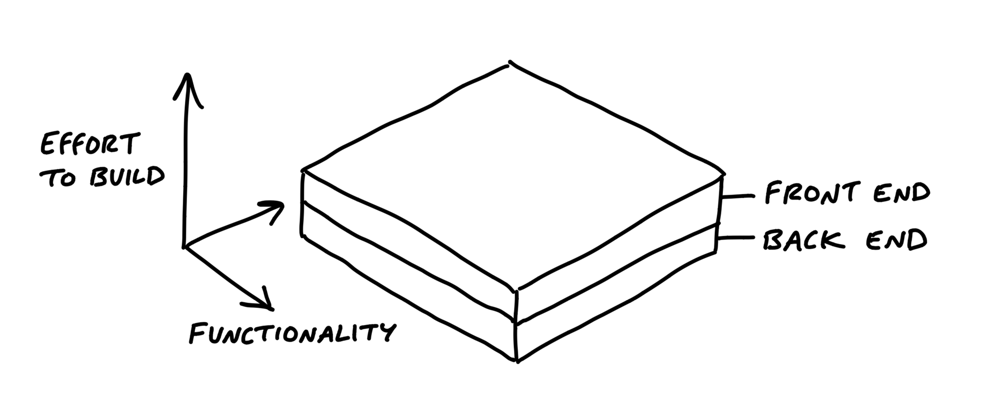
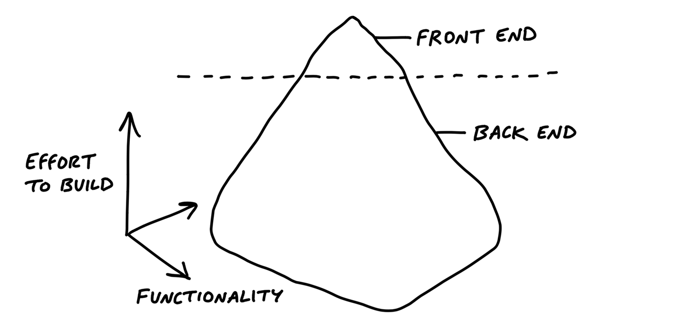

# نقشه‌برداری از اسکوپ‌ها

> فصل ۱۲ از کتاب شیپ‌آپ  
> منبع: [Shape Up - Map the Scopes](https://basecamp.com/shapeup/3.3-chapter-12)

برای مدیریت پروژه در طول چرخه، تیم باید کار را به اسکوپ‌های معنادار تقسیم کند. اسکوپ‌ها فهرست وظایف خشک نیستند؛ بخش‌هایی از پروژه‌اند که می‌توان آن‌ها را فهمید، ساخت، یکپارچه کرد و تمام‌شده دانست.

## بر اساس ساختار سازمان‌دهی کنید، نه افراد

تقسیم کار بر اساس افراد باعث می‌شود تصویر پروژه پنهان شود. بهتر است کار را بر اساس ساختار محصول و رفتارهای قابل تشخیص سازمان‌دهی کنیم. اسکوپ باید بخشی از محصول را بیان کند، نه مسئولیت یک نفر را.

## نقشه اسکوپ

نقشه اسکوپ نشان می‌دهد پروژه از چه بخش‌هایی تشکیل شده است. این نقشه با پیشرفت کار تغییر می‌کند؛ چون تیم در حین ساختن، مرزهای واقعی کار را بهتر می‌فهمد.

## زبان پروژه

وقتی اسکوپ‌ها نام‌گذاری می‌شوند، تیم زبان مشترکی پیدا می‌کند. به جای گفتن «آن تسک‌های سمت بک‌اند» یا «صفحه فلان»، می‌توان درباره «پیش‌نویس پیام»، «دعوت مشتری» یا «اعلان‌ها» صحبت کرد. نام خوب، فهم مشترک می‌سازد.

## مطالعه موردی: پیش‌نویس پیام‌ها

در قابلیت پیش‌نویس پیام، تیم هنگام کار متوجه می‌شود پروژه فقط یک قابلیت واحد نیست. ذخیره خودکار، بازیابی پیش‌نویس، نمایش وضعیت و رفتار هنگام ترک صفحه هرکدام اسکوپ جداگانه‌ای می‌سازند.

## کشف اسکوپ‌ها

اسکوپ‌ها معمولاً از قبل کامل معلوم نیستند. تیم با ساختن برش‌های واقعی، کار را بهتر می‌بیند و اسکوپ‌ها را بازآرایی می‌کند. این کشف بخشی طبیعی از چرخه است.

## از کجا بفهمیم اسکوپ‌ها درست‌اند؟

اسکوپ خوب قابل توضیح، قابل تکمیل و قابل حرکت دادن روی نمودار تپه‌ای است. اگر اسکوپی بیش از حد بزرگ است، باید شکسته شود. اگر اسکوپی فقط یک وظیفه فنی کوچک است، شاید باید در اسکوپ بزرگ‌تری قرار بگیرد.

## کیک لایه‌ای

کیک لایه‌ای اسکوپی است که سطح کار در لایه‌های مختلف تقریباً هم‌اندازه دیده می‌شود: کمی طراحی، کمی بک‌اند، کمی فرانت‌اند. این نوع اسکوپ معمولاً قابل پیش‌بینی‌تر است.

## کوه یخ

کوه یخ وقتی است که ظاهر کار کوچک است اما پشت آن کار فنی زیادی پنهان شده، یا برعکس. شناخت کوه یخ مهم است چون ممکن است پیشرفت ظاهری، میزان واقعی کار را نشان ندهد.

## آش شله‌قلمکار

گاهی اسکوپ‌ها در هم قاطی می‌شوند و هیچ مرز روشنی ندارند. در این حالت، تیم باید کار را دوباره دسته‌بندی کند تا هر اسکوپ معنا و پایان مشخص داشته باشد.

## موارد خوب‌بودنی را با ~ علامت بزنید

همه چیز ضروری نیست. کارهایی که خوب است انجام شوند اما برای عرضه لازم نیستند، با `~` مشخص می‌شوند. این علامت به تیم کمک می‌کند در روزهای پایانی چرخه، اسکوپ را هوشمندانه کم کند.
