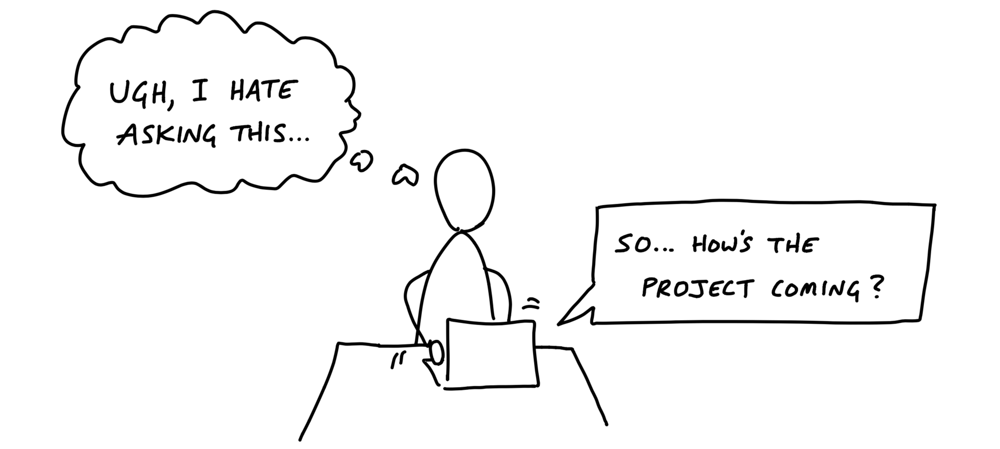
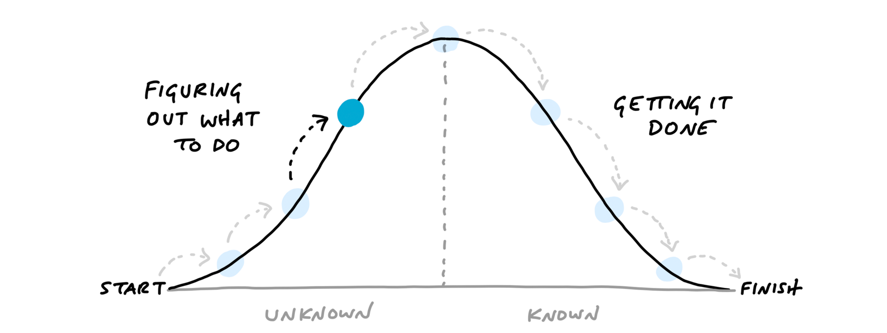
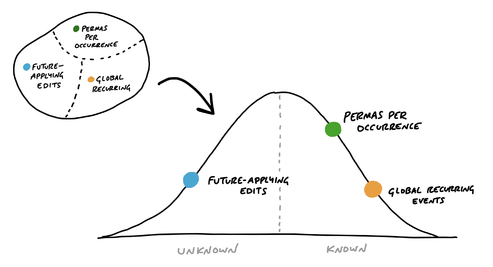
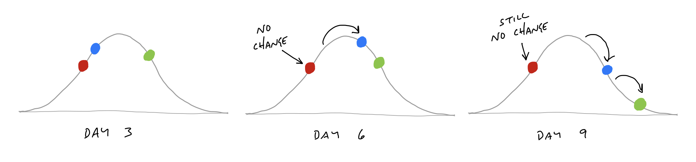

# نشان دادن پیشرفت

> فصل ۱۳ از کتاب شیپ‌آپ
> منبع: [Shape Up - Show Progress](https://basecamp.com/shapeup/3.4-chapter-13)

پیشرفت در پروژه نرم‌افزاری فقط با تعداد تسک‌های انجام‌شده معلوم نمی‌شود. مسئله مهم این است که چقدر از ناشناخته‌ها حل شده و چه مقدار کار صرفاً اجرای باقی‌مانده است.

## تسک‌هایی که هنوز وجود ندارند

در ابتدای پروژه، بسیاری از تسک‌های واقعی هنوز کشف نشده‌اند. اگر پیشرفت را فقط با چک‌لیست اولیه بسنجیم، تصویر غلطی می‌گیریم. تیم ممکن است نصف تسک‌ها را زده باشد، اما تازه به بخش سخت و نامعلوم رسیده باشد.

## تخمین‌ها عدم‌قطعیت را نشان نمی‌دهند

تخمین عددی معمولاً نمی‌گوید کار چقدر نامعلوم است. دو تسک با زمان تخمینی برابر می‌توانند ریسک کاملاً متفاوتی داشته باشند. یکی فقط اجراست، دیگری هنوز نیاز به کشف دارد.

## کار مثل تپه است

نمودار تپه‌ای کار را از «نامعلوم» به «معلوم» و سپس به «انجام‌شده» نشان می‌دهد. سمت چپ تپه، بالا رفتن و حل کردن ناشناخته‌هاست. قله جایی است که راه‌حل روشن شده. سمت راست، پایین آمدن و اجرای کار معلوم است.

## اسکوپ‌ها روی تپه

به جای نمایش کل پروژه به شکل یک نقطه، هر اسکوپ روی نمودار تپه‌ای قرار می‌گیرد. این کار نشان می‌دهد کدام بخش‌ها هنوز در ابهام‌اند و کدام‌ها فقط نیاز به اجرا دارند.

## وضعیت بدون پرسیدن

وقتی تیم‌ها خودشان اسکوپ‌ها را روی نمودار حرکت می‌دهند، مدیران لازم نیست مدام بپرسند «وضعیت چیست؟» نمودار، وضعیت را به شکل بصری و قابل فهم نشان می‌دهد.

## هیچ‌کس نمی‌گوید «نمی‌دانم»

گزارش‌های متنی معمولاً افراد را وادار می‌کند با قطعیت ظاهری حرف بزنند. نمودار تپه‌ای اجازه می‌دهد تیم صادقانه نشان دهد هنوز در سمت نامعلوم کار است.

## نشانه‌هایی برای بازآرایی اسکوپ‌ها

اگر اسکوپی مدت زیادی حرکت نمی‌کند، شاید خیلی بزرگ یا بد تعریف شده است. تیم باید آن را بشکند، نام‌گذاری کند یا از دل آن اسکوپ پنهان دیگری بیرون بکشد.

## مسیر سربالایی را با ساختن طی کنید

حل کردن ناشناخته‌ها فقط با بحث اتفاق نمی‌افتد. تیم باید بسازد، آزمایش کند و با محصول واقعی برخورد کند. حرکت روی تپه نتیجه ساختن و یاد گرفتن است.

## ترتیب درست حل کردن

باید ابتدا پرریسک‌ترین و نامعلوم‌ترین بخش‌ها را بالا برد. اگر تیم فقط کارهای ساده را انجام دهد، پروژه در ظاهر جلو می‌رود اما خطر اصلی تا پایان چرخه باقی می‌ماند.
