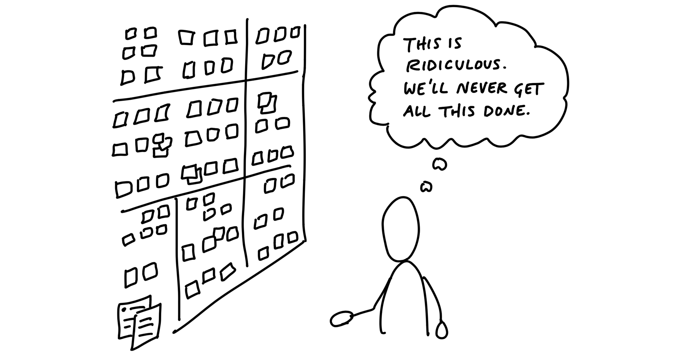

# شرط‌بندی، نه بک‌لاگ

> فصل ۷ از کتاب شیپ‌آپ
> منبع: [Shape Up - Bets, Not Backlogs](https://basecamp.com/shapeup/2.1-chapter-07)

بعد از اینکه کار شیپ شد، هنوز نباید فرض کنیم حتماً ساخته می‌شود. در شیپ‌آپ، ایده‌های شیپ‌شده روی میز شرط‌بندی می‌آیند و فقط بعضی از آن‌ها برای چرخه بعدی انتخاب می‌شوند.

## بک‌لاگ نداریم

بک‌لاگ اغلب به انباری از وعده‌ها تبدیل می‌شود. هر آیتمی که به آن اضافه می‌شود، ظاهراً «فراموش نشده»، اما در عمل فقط بار ذهنی تیم را بیشتر می‌کند. بک‌لاگ‌ها معمولاً پر از ایده‌هایی هستند که زمینه، فوریت و کیفیت شیپینگ آن‌ها با هم فرق دارد.

در شیپ‌آپ، ایده‌های خام در بک‌لاگ ذخیره نمی‌شوند. اگر ایده‌ای مهم باشد، دوباره برمی‌گردد؛ از مشتری، از داده، از مکالمه‌های داخلی یا از فشار واقعی بازار.

## چند شرط بالقوه

به جای بک‌لاگ بزرگ، در هر زمان چند گزینه جدی برای شرط‌بندی وجود دارد. این گزینه‌ها پیچ‌هایی هستند که به اندازه کافی شیپ شده‌اند و می‌توان درباره آن‌ها تصمیم گرفت. تمرکز روی چند گزینه باکیفیت بهتر از مدیریت صدها آیتم نیمه‌پخته است.

## فهرست‌های غیرمتمرکز

افراد می‌توانند برای خودشان یادداشت، ایده و فهرست داشته باشند. ممنوعیت بک‌لاگ به معنی ممنوعیت فکر کردن نیست. تفاوت در این است که سازمان یک صف رسمی از وعده‌ها نمی‌سازد. وقتی کسی واقعاً به ایده‌ای باور دارد، باید آن را شیپ کند و به عنوان پیچ مطرح کند.

## ایده‌های مهم برمی‌گردند

اگر ایده‌ای واقعاً مهم باشد، ناپدید نمی‌شود. دوباره از مسیرهای مختلف ظاهر می‌شود و هر بار زمینه تازه‌ای به ما می‌دهد. همین بازگشت طبیعی، بهتر از ثبت کردن زودهنگام همه چیز در بک‌لاگ، اهمیت واقعی ایده را نشان می‌دهد.
