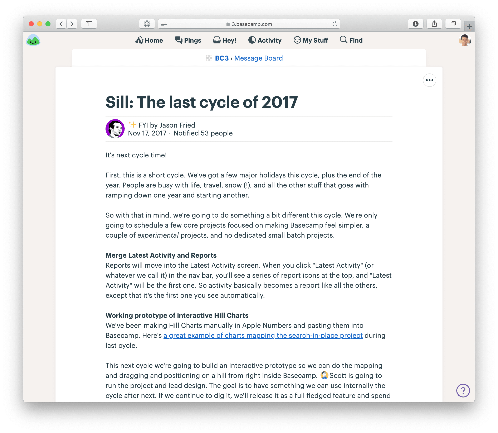

# شرط‌های خود را بگذارید

> فصل ۹ از کتاب شیپ‌آپ  
> منبع: [Shape Up - Place Your Bets](https://basecamp.com/shapeup/2.3-chapter-09)

وقتی زمان شرط‌بندی می‌رسد، باید به موقعیت فعلی محصول و سازمان نگاه کنیم. انتخاب پروژه فقط مقایسه ایده‌ها نیست؛ باید ببینیم اکنون در چه مرحله‌ای هستیم و چه نوع پیشرفتی بیشترین ارزش را دارد.

## ببینید کجا هستید

پروژه مناسب برای یک محصول بالغ با پروژه مناسب برای محصول تازه فرق دارد. گاهی باید قابلیت جدید ساخت، گاهی باید زیرساخت را تثبیت کرد، و گاهی باید با یک آزمایش، مسیر آینده را روشن کرد.

## محصولات موجود

در محصول موجود، تصمیم‌ها باید نسبت به کاربران فعلی، بدهی‌های محصول، محدودیت‌های سیستم و فرصت‌های رشد سنجیده شوند. یک تغییر کوچک در جای درست می‌تواند ارزش زیادی داشته باشد، در حالی که یک بازطراحی بزرگ ممکن است هزینه زیادی بسازد.

## محصولات جدید

در محصول جدید، عدم‌قطعیت بیشتر است. تیم هنوز نمی‌داند هسته محصول دقیقاً چه شکلی خواهد داشت. در این مرحله، ممکن است لازم باشد به جای چرخه‌های استاندارد، ابتدا آزمایش‌های عمیق‌تری انجام شود.

## حالت تحقیق و توسعه

در حالت R&D، هدف عرضه فوری نیست؛ هدف کشف معماری، امکان‌پذیری و شکل هسته محصول است. این کار باید به افراد باتجربه سپرده شود که می‌توانند سریع نمونه بسازند و تصمیم‌های بنیادی بگیرند.

## حالت تولید

وقتی هسته محصول روشن شد، می‌توان وارد حالت تولید شد. در این حالت، فرایند استاندارد شیپ‌آپ کار می‌کند: شیپینگ، پیچ، شرط‌بندی، چرخه و عرضه.

## حالت تمیزکاری

نزدیک عرضه محصول جدید، گاهی بهتر است روی پروژه‌های جداگانه شرط نبندیم و یک دوره تمیزکاری باز داشته باشیم. هدف در این مرحله رفع مانع‌های باقی‌مانده برای عرضه است، نه اضافه کردن قابلیت‌های تازه.

## مثال‌ها

در تقویم جدول نقطه‌ای، مسئله مشخص و اشتهای زمانی محدود بود. در محصول جدیدی مثل HEY، ابتدا باید معماری و تجربه اصلی شکل می‌گرفت. در قابلیت آزمایشی مثل نمودار تپه‌ای، یک شرط می‌تواند بیشتر جنبه کشف و اعتبارسنجی داشته باشد.

## پرسش‌هایی برای تصمیم‌گیری

قبل از شرط‌بندی، این پرسش‌ها را مرور کنید:

### آیا مسئله مهم است؟

اگر مسئله برای مشتری یا محصول اهمیت کافی ندارد، حتی یک راه‌حل خوب هم نباید چرخه بگیرد.

### آیا اشتهای زمانی درست است؟

گاهی مسئله مهم است، اما اشتهای زمانی کم یا زیاد انتخاب شده است. شرط خوب باید با اندازه درست بسته شود.

### آیا راه‌حل جذاب است؟

راه‌حل باید نسبت به هزینه زمانی، ارزش کافی داشته باشد. اگر راه‌حل فقط کمی بهتر از وضعیت فعلی است، شاید ارزش شرط نداشته باشد.

### آیا زمان درستی است؟

ممکن است پروژه خوبی باشد، اما اکنون زمان آن نباشد. وابستگی‌ها، فصل کاری، وضعیت تیم یا اولویت‌های محصول می‌توانند زمان‌بندی را تغییر دهند.

### آیا افراد درست در دسترس هستند؟

شرط بدون تیم مناسب معنی ندارد. اگر طراح یا برنامه‌نویس لازم در چرخه آینده در دسترس نیست، باید انتخاب دیگری کرد یا زمان پروژه را عقب انداخت.

## پیام شروع کار را منتشر کنید

بعد از انتخاب شرط، پیام شروع کار باید پروژه را برای تیم توضیح دهد: مسئله، پیچ، اشتهای زمانی، افراد درگیر و انتظار عرضه. این پیام نقطه آغاز چرخه است.

