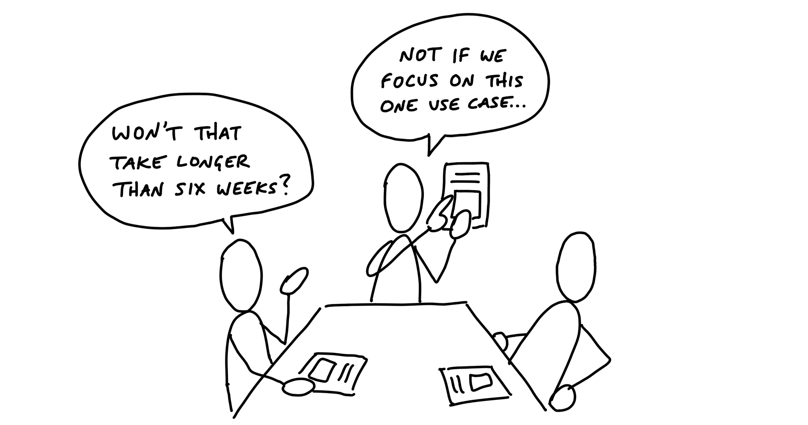

# میز شرط‌بندی

> فصل ۸ از کتاب شیپ‌آپ
> منبع: [Shape Up - The Betting Table](https://basecamp.com/shapeup/2.2-chapter-08)

میز شرط‌بندی جایی است که تصمیم می‌گیریم چرخه بعدی روی چه چیزی خرج شود. این جلسه برای اولویت‌بندی بک‌لاگ نیست؛ برای انتخاب چند شرط محدود از میان پیچ‌های آماده است.

## چرخه‌های شش‌هفته‌ای

چرخه شش‌هفته‌ای واحد اصلی کار است. تیم در این مدت روی پروژه انتخاب‌شده تمرکز می‌کند و انتظار می‌رود در پایان چرخه چیزی قابل عرضه داشته باشد. کوتاه‌تر از این، ساختن کار معنی‌دار سخت می‌شود؛ طولانی‌تر از این، فشار زمان از بین می‌رود.

## کول‌داون

بین چرخه‌ها یک کول‌داون وجود دارد. در این دوره، تیم‌ها می‌توانند کارهای کوچک، باگ‌ها، تمیزکاری‌ها یا ایده‌های آزاد را انجام دهند. میز شرط‌بندی هم معمولاً در همین فاصله برگزار می‌شود.

## اندازه تیم و پروژه

پروژه‌ها برای تیم‌های کوچک شیپ می‌شوند: معمولاً یک طراح و یک یا دو برنامه‌نویس. اگر پروژه برای چنین تیمی در یک چرخه قابل عرضه نیست، باید دوباره شیپ شود یا بخش معناداری از آن جدا شود.

## میز شرط‌بندی

افرادی که اختیار تصمیم‌گیری دارند، پیچ‌ها را کنار هم می‌گذارند و می‌پرسند کدام شرط در این زمان بیشترین ارزش را دارد. نتیجه جلسه باید تصمیم روشن باشد: کدام پروژه‌ها وارد چرخه می‌شوند و کدام‌ها فعلاً کنار گذاشته می‌شوند.

## معنای شرط

شرط یعنی تعهد دادن یک تیم به یک پروژه برای یک چرخه کامل، بدون مزاحمت و با انتظار عرضه. شرط، وعده نامحدود نیست؛ یک سرمایه‌گذاری محدود با زمان ثابت است.

## زمان بدون مزاحمت

وقتی روی پروژه‌ای شرط می‌بندیم، تیم باید در چرخه از درخواست‌های پراکنده محافظت شود. اگر هر روز کار جدیدی وارد شود، شرط معنای خود را از دست می‌دهد. تمرکز، بخشی از قرارداد چرخه است.

## قطع‌کننده مدار

اگر پروژه در پایان چرخه عرضه نشود، پیش‌فرض تمدید خودکار نیست. قطع‌کننده مدار باعث می‌شود پروژه‌های ناتمام بدون بررسی دوباره ادامه پیدا نکنند. شاید پروژه ارزش تمدید داشته باشد، اما باید دوباره درباره آن تصمیم گرفت.

## باگ‌ها چه می‌شوند؟

باگ‌ها واقعیت محصول هستند، اما نباید هر باگ مسیر چرخه را بشکند. موارد فوری جداگانه رسیدگی می‌شوند؛ باگ‌های معمولی می‌توانند در کول‌داون یا زمان‌های مشخص رفع شوند. هدف این است که پروژه‌های چرخه زیر بار وقفه‌های مداوم خرد نشوند.

## صفحه را تمیز نگه دارید

بعد از هر چرخه، صفحه باید تمیز شود. پروژه‌های تمام‌شده عرضه می‌شوند، پروژه‌های ناتمام به طور خودکار به چرخه بعدی نمی‌روند و ایده‌ها فقط اگر دوباره شیپ و انتخاب شوند ادامه پیدا می‌کنند.
